# Game Flow After "Éliminer" Button Click

This document describes the complete flow of the French Grammar Impostors game after the player clicks an "Éliminer" button in Impostor Mode.

## Mermaid Flow Diagram

```mermaid
flowchart TD
    Start([Player clicks Éliminer button on a crewmate])

    Start --> CaptureInput[Capture Hugo's current phrase input]
    CaptureInput --> SetActionFlag[Set actionInProgress = true]
    SetActionFlag --> HideButtons[Update display to hide all action buttons]
    HideButtons --> PlayKnife[Play knife stab sound effect]

    PlayKnife --> PlayDeadBody[Play dead body reported sound]
    PlayDeadBody --> MarkDead[Mark victim as dead<br/>Set deathPhrase]
    MarkDead --> SetDeadChar[Set currentDeadCharacter = victimId<br/>Clear currentEjectedCharacter]
    SetDeadChar --> UpdateDisplay1[Update display to show dead crewmate]
    UpdateDisplay1 --> Wait3Sec[Wait 3 seconds]

    Wait3Sec --> EmergencyMeeting[gamePhase = 'emergency_meeting']
    EmergencyMeeting --> PauseTimer[Pause task progress timer]
    PauseTimer --> ResetAction[Set actionInProgress = false]
    ResetAction --> CalcVotes[Calculate voting results using phrase analyzer]

    CalcVotes --> AnalyzePhrase[Analyze Hugo's submission vs correct phrase<br/>Count errors for votes needed]
    AnalyzePhrase --> CheckPerfect{Hugo's French<br/>perfect?}

    CheckPerfect -->|Yes: 0 votes needed| ClearPersistent[Clear persistent voters list]
    ClearPersistent --> FindScapegoat{Other impostors<br/>alive?}
    FindScapegoat -->|Yes| VoteOutImp[Vote out random impostor<br/>All characters vote]
    FindScapegoat -->|No| VoteOutHugo1[Vote out Hugo<br/>All characters vote]

    CheckPerfect -->|No: errors found| StartAutomated[Start automated voting system<br/>gamePhase = 'voting']
    StartAutomated --> ScheduleFirst[Schedule first vote after 5 seconds]
    ScheduleFirst --> WaitVote[Wait for vote timer]

    WaitVote --> CastVote[Random alive crewmate votes for Hugo]
    CastVote --> AddPersistent[Add voter to persistent voters list]
    AddPersistent --> RecordVote[Record vote in individualVotes]
    RecordVote --> IncrementCount[Increment votesCastForHugo]
    IncrementCount --> UpdateVoteDisplay[Update display to show new vote]

    UpdateVoteDisplay --> NeedMore{More votes<br/>needed?}
    NeedMore -->|Yes| ScheduleNext[Schedule next vote<br/>random 0-3 second delay]
    ScheduleNext --> WaitVote

    NeedMore -->|No| FinishVoting[Set final voting results]
    VoteOutImp --> FinishVoting
    VoteOutHugo1 --> FinishVoting

    FinishVoting --> ClearTimers[Clear all voting timers]
    ClearTimers --> ReturnEmergency[gamePhase = 'emergency_meeting']
    ReturnEmergency --> ShowTally[Display emergency meeting with vote tally]
    ShowTally --> Wait2Sec[Wait 2 seconds]

    Wait2Sec --> FindMostVotes[Find character with most votes]
    FindMostVotes --> EjectChar[Mark character as ejected<br/>Set deathPhrase based on role]
    EjectChar --> SetEjectedChar[Set currentEjectedCharacter<br/>Clear currentDeadCharacter]
    SetEjectedChar --> CheckHugoEjected{Hugo<br/>ejected?}

    CheckHugoEjected -->|Yes| EndGameHugo[gameOver = true<br/>gamePhase = 'game_over']
    EndGameHugo --> StopAllTimers1[Clear all timers]
    StopAllTimers1 --> ShowDefeat[Show defeat message]
    ShowDefeat --> End1([Game Over - Hugo Ejected])

    CheckHugoEjected -->|No| CheckVictory{All crewmates<br/>eliminated?}
    CheckVictory -->|Yes| EndVictory[gameOver = true<br/>gamePhase = 'impostor_victory']
    EndVictory --> StopAllTimers2[Clear all timers]
    StopAllTimers2 --> ShowVictory[Show victory message]
    ShowVictory --> End2([Game Over - Impostors Win])

    CheckVictory -->|No| Wait3SecNext[Wait 3 seconds]
    Wait3SecNext --> NextRound[Increment round number<br/>Reset hasVoted flag]
    NextRound --> ResumeTimer[Resume task progress timer]
    ResumeTimer --> NewPhrase[Start new phrase correction phase<br/>Select new random phrase for Hugo]
    NewPhrase --> End3([Continue to next round])

    style Start fill:#ff6b6b
    style End1 fill:#ff4444
    style End2 fill:#44ff44
    style End3 fill:#4444ff
    style EmergencyMeeting fill:#ffaa00
    style StartAutomated fill:#ffaa00
    style CheckPerfect fill:#ffee88
    style FindScapegoat fill:#ffee88
    style CheckHugoEjected fill:#ffee88
    style CheckVictory fill:#ffee88
    style NeedMore fill:#ffee88
```

## Key Functions Called (in order)

1. **killCrewmate()** _(impostor-core.js:257)_ - Entry point when Éliminer button clicked
2. **updateImpostorDisplay()** _(impostor-ui.js:5)_ - Update UI to hide buttons
3. **playKnifeStabSound()** _(audio-engine.js)_ - Play knife sound effect
4. **playDeadBodyReportedSound()** _(audio-engine.js)_ - Play dead body sound
5. **proceedToEmergencyMeeting()** _(impostor-core.js:296)_ - Transition to meeting phase
6. **pauseTaskProgressTimer()** _(impostor-core.js:185)_ - Pause the task timer
7. **calculateVotingResults()** _(impostor-core.js:312)_ - Analyze Hugo's phrase for errors
8. **analyzePhraseComparison()** _(phrase-analyzer.js)_ - Count grammar errors
9. **startAutomatedVoting()** _(impostor-core.js:351)_ - Begin automated voting
10. **castAutomatedVote()** _(impostor-core.js:375)_ - Cast individual votes
11. **finishAutomatedVoting()** _(impostor-core.js:438)_ - Complete voting phase
12. **voteOutCharacter()** _(impostor-core.js:467)_ - Eject character with most votes
13. **checkImpostorVictory()** _(impostor-core.js:509)_ - Check win condition
14. **startNextRound()** _(impostor-core.js:517)_ - Start new round if game continues
15. **startPhraseCorrection()** _(impostor-core.js:209)_ - Begin next phrase correction

## Game State Changes

### Phase Transitions
- `phrase_correction` → `emergency_meeting` → `voting` → `emergency_meeting` → (next round or game over)

### Key State Variables
- `actionInProgress`: Prevents multiple simultaneous actions
- `currentDeadCharacter`: Tracks most recently killed character
- `currentEjectedCharacter`: Tracks most recently ejected character
- `votesNeededForHugo`: Based on grammar errors in Hugo's submission
- `votesCastForHugo`: Incremented as votes are cast
- `persistentVoters`: Crewmates who voted for Hugo and will continue voting
- `individualVotes`: Detailed vote tracking for display

## Audio Feedback
1. Knife stab sound when crewmate is killed
2. Dead body reported sound immediately after

## Timing
- 3 seconds after kill before emergency meeting
- 5 seconds before first automated vote
- 0-3 seconds random delay between subsequent votes
- 2 seconds to display final vote tally
- 3 seconds after ejection before next round

## Win/Lose Conditions Checked
1. **Hugo Ejected**: Game over - crew wins
2. **All Crewmates Eliminated**: Game over - impostors win
3. **Tasks Completed** (180 seconds): Game over - crew wins (checked separately by timer)